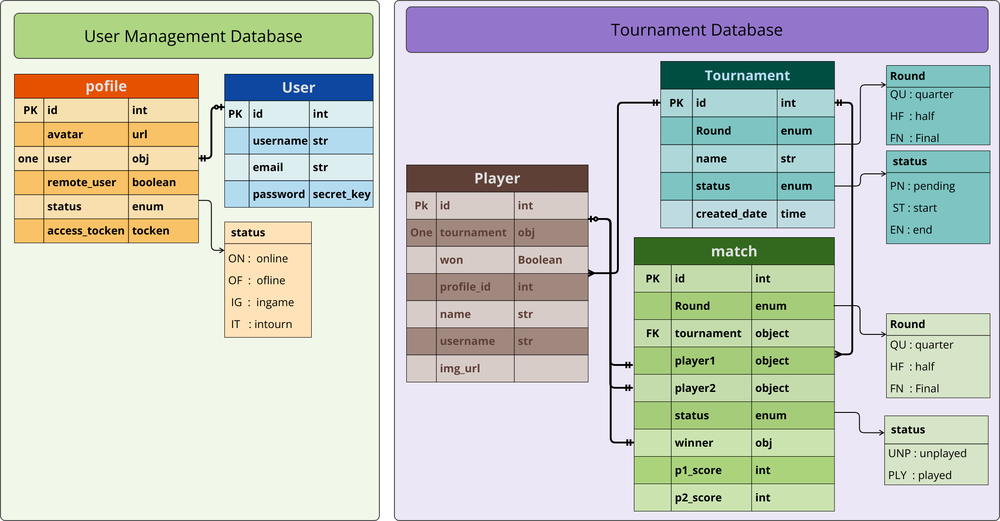

<h1>Transcendence</h1>

<h2>Project Overview</h2>
<h4>Transcendence is a website of ping pong game with possibility of create users and play remote/local games and tournaments, store matches of games and tournaments in data base.</h4>
<h2>Project Tech Stack</h2>
<h4>In this project we use, Django in Backend and JS,HTML,CSS in Frontend and Postgresql as databas</h4>

---
#### Represintation of relationships in a UML Diagram
</img>

<h3>Database schema</h3>
</img>
